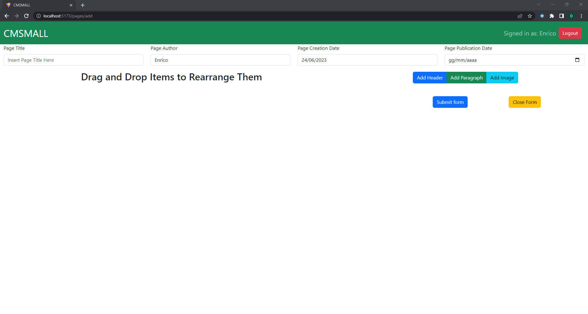
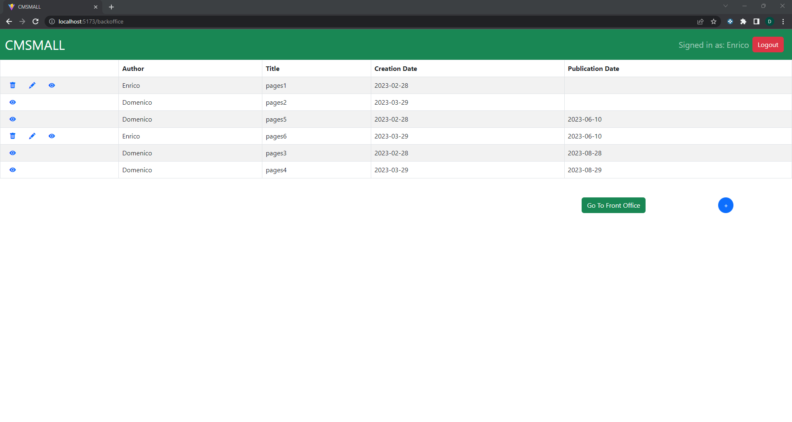

[](https://classroom.github.com/a/suhcjUE-)
# Exam #1: "CMSMALL"
## Student: s310454 GAGLIARDO DOMENICO 

## React Client Application Routes

- Route `/`  : main web page that contains the published pages available in the application (front office).
- Route `/backoffice`  : web page that contains all the pages available in the application, available only if logged in (back office).
- Route `/login`  : web page used to display the login form, in blockOrder to perform the login
- Route `/pages/add`  : web page that contains an empty page structure, used to create a page for a certain user. 
- Route `/pages/view/:id`  : web page that contains a single page that has been opened, used to view that page in detail. `:id`: Route param that identifies the id of the page to be viewed.
- Route `/pages/edit/:id`  : web page that contains a single page that has been opened, used to edit the page (if logged user with the rights or admin). `:id`: Route param that identifies the id of the page to edit.

## API Server

### USERS API
- POST `/api/sessions`
  - Description: Create a new session starting from given credentials (no authentication required).

    Request body: username and password for performing login (Content-Type: `application/json`).
    <details>
      <summary>Request Details</summary>
      
      ```
      {
        "username": "admin@gmail.com",
        "password": "pass"
      }
      ```
    </details>

    Response: `200 OK` (success) or `401 Unauthorized` (error).

    Response body: user information of the user that now is logged in (Content-Type: `application/json`).
    <details>
      <summary>Response Details</summary>

      ```
      {
        "id": 3,
        "email": "admin@gmail.com",
        "isAdmin": 1,
        "username": "Admin"
      }
      ```
    </details>
- GET `/api/sessions/current`
  - Description: Verify if the given session is still valid and return the info about the logged-in user. A cookie with a VALID SESSION ID must be provided.

    Request body: _None_ 

    Response: `200 OK` (success) or `401 Unauthorized` (error).

    Response body: user information of the current logged in user (Content-Type: `application/json`).
    <details>
      <summary>Response Details</summary>

      ```
      {
        "id": 3,
        "email": "admin@gmail.com",
        "isAdmin": 1,
        "username": "Admin"
      }
      ```
    </details>
- DELETE `/api/session/current`
  - Description: Delete the current session. A cookie with a VALID SESSION ID must be provided.

    Request body: _None_

    Response: `200 OK` (success) or `401 Unauthorized` (error).

    Response body: _None_
- GET `/api/users`
  - Description: Get All The Users of The Application. A cookie with a VALID SESSION ID must be provided.

    Request body: _None_ 

    Response: `200 OK` (success) or `401 Unauthorized` (error) or `403 Forbidden` (error) or `503 Service Unavailable` (Database error).

    Response body: an array of userId,username pair (Content-Type: `application/json`).
    <details>
      <summary>Response Details</summary>

      ```
      [{
        "id": 2,
        "username": "Giorgio"
      },
      ...
      ]
      ```
    </details>

### PAGES API
- GET `/api/pages/backoffice`
  - Description: Get all the pages for the backoffice visualization. A cookie with a VALID SESSION ID must be provided.

    Request body: _None_

    Response: `200 OK` (success) or `401 Unauthorized` (error) or `503 Service Unavailable` (Database error).

    Response body: An array of objects, each describing a page. (Content-Type: `application/json`).
    <details>
      <summary>Response Details</summary>
      
      ```
      [{
          "id": 1,
          "userId": 1,
          "username": "Enrico",
          "title": "Pagina1",
          "creationDate": "2023-02-28",
          "publicationDate": "2023-02-28",
      },
      ...
      ]
      ```
    </details> 
- GET `/api/pages/frontoffice`
  - Description: Get only-published pages for the frontoffice visualization (no authentication required).

    Request body: _None_

    Response: `200 OK` (success) or `503 Service Unavailable` (Database error).

    Response body: An array of objects, each describing a page. (Content-Type: `application/json`).
    <details>
      <summary>Response Details</summary>

      ```
      [{
          "id": 1,
          "userId": 1,
          "username": "Enrico",
          "title": "Pagina1",
          "creationDate": "2023-02-28",
          "publicationDate": "2023-02-28",
      },
      ...
      ]
      ```
    </details> 
- GET `/api/pages/backoffice/<id>`
  - Description: Get a specific page, identified by the id `<id>`, along with the associated blocks (authentication required). A cookie with a VALID SESSION ID must be provided.

    Request body: _None_

    Response: `200 OK` (success) or `401 Unauthorized` (error) or `404 Not Found` (not found error) or `422 Unprocessable Entity` (semantic error) or `503 Service Unavailable` (Database error) or `500 Internal Server Error` (generic error).

    Response body: An object describing a page, with an array of objects, each describing a block. (Content-Type: `application/json`).
    <details>
      <summary>Response Details</summary>

      ```
      {
          "id": 1,
          "userId": 1,
          "username": "Enrico",
          "title": "Pagina1",
          "creationDate": "2023-02-28",
          "publicationDate": "2023-02-28",
          "blocks" : [{
              "id": 1,
              "pageId": 1,
              "type": "Header",
              "content": "Ciao Sono Domenico",
              "blockOrder": "1",
          },
          ...
          ]
      }
      ```
    </details>
- GET `/api/pages/frontoffice/<id>`
  - Description: Get a specific published-only page, identified by the id `<id>`, along with the associated blocks (no authentication required).

    Request body: _None_

    Response: `200 OK` (success) or `403 Forbidden` (error) or `404 Not Found` (not found error) or `422 Unprocessable Entity` (semantic error) or `503 Service Unavailable` (Database error) or `500 Internal Server Error` (generic error).

    Response body: An object describing a page, with an array of objects, each describing a block. (Content-Type: `application/json`).
    <details>
      <summary>Response Details</summary>

      ```
      {
          "id": 1,
          "userId": 1,
          "username": "Enrico",
          "title": "Pagina1",
          "creationDate": "2023-02-28",
          "publicationDate": "2023-02-28",
          "blocks" : [{
              "id": 1,
              "pageId": 1,
              "type": "Header",
              "content": "Ciao Sono Domenico",
              "blockOrder": "1",
          },
          ...
          ]
      }
      ```
    </details>
- POST `/api/pages`
  - Description: Create a new Page, along with the associated blocks. A cookie with a VALID SESSION ID must be provided.

    Request body: An object representing a page and the associated blocks (Content-Type: `application/json`).
    <details>
      <summary>Request Details</summary>

      ```
      {
          "userId": 1,
          "username": "Enrico",
          "title": "Pagina1",
          "creationDate": "2023-02-28",
          "publicationDate": "2023-02-28",
          "blocks" : [{
              "type": "Header",
              "content": "Ciao Sono Domenico",
              "blockOrder": "1",
          },
          ...
          ]
      }
      ```
    </details>

    Response: `200 OK` (success) or `401 Unauthorized` (error) or `403 Forbidden` (error) or `404 Not Found` (not found error) or `422 Unprocessable Entity` (semantic error) or `503 Service Unavailable` (Unavailability error) or `500 Internal Server Error` (generic error).

    Response body: An object representing the inserted page and the associated blocks, notably with the newly assigned id by the database (Content-Type: `application/json`).
    <details>
      <summary>Response Details</summary>

      ```
      {
          "id": 1,
          "userId": 1,
          "username": "Enrico",
          "title": "Pagina1",
          "creationDate": "2023-02-28",
          "publicationDate": "2023-02-28",
          "blocks" : [{
              "id": 1,
              "pageId": 1,
              "type": "Header",
              "content": "Ciao Sono Domenico",
              "blockOrder": "1",
          },
          ...
          ]
      }
      ```
    </details>
- POST `/api/pages/<id>`
  - Description: Update a Page, identified by the id `<id>`, along with the associated blocks. A cookie with a VALID SESSION ID must be provided.

    Request body: An object representing a page and the associated blocks (Content-Type: `application/json`).
    <details>
      <summary>Request Details</summary>

      ```
      {
        "id": 1,
        "userId": 1,
        "username": "Enrico",
        "title": "pages1",
        "creationDate": "2023-02-28",
        "publicationDate": "2023-03-29",
        "blocks": [
          {
            "type": "Header",
            "content": "Blog",
            "blockOrder": 1
          },
          {
            "type": "Paragraph",
            "content": "Ciao Sono Enrico",
            "blockOrder": 2
          }
        ]
      }
      ```
    </details>

    Response: `200 OK` (success) or `401 Unauthorized` (error) or `403 Forbidden` (error) or `404 Not Found` (not found error) or `422 Unprocessable Entity` (semantic error) or `503 Service Unavailable` (Unavailability error) or `500 Internal Server Error` (generic error).


    Response body: An object representing the updated page, notably with the newly assigned id by the database (Content-Type: `application/json`).
    <details>
      <summary>Response Details</summary>

      ```
      {
        "id": 1,
        "userId": 1,
        "username": "Enrico",
        "title": "pages1",
        "creationDate": "2023-02-28",
        "publicationDate": "2023-03-29",
        "blocks": [
          {
            "id": 31,
            "pageId": 1,
            "type": "Header",
            "content": "Blog",
            "blockOrder": 1
          },
          {
            "id": 32,
            "pageId": 1,
            "type": "Paragraph",
            "content": "Ciao Sono Enrico",
            "blockOrder": 2
          }
        ]
      }
      ```
    </details>
- DELETE `/api/pages/<id>`
  - Description: Delete a Page, identified by the id `<id>`. A cookie with a VALID SESSION ID must be provided.

    Request body: _None_

    Response: `200 OK` (success) or `401 Unauthorized` (error) or `403 Forbidden` (error) or `404 Not Found` (not found error) or `422 Unprocessable Entity` (semantic error) or `503 Service Unavailable` (Database error) or `500 Internal Server Error` (generic error).

    Response body: _None_

### WEBSITE API
- GET `/api/websites`
  - Description: Get the website name (no authentication required).

    Request body: _None_

    Response: `200 OK` (success) or `503 Service Unavailable` (Database error).

    Response body: An object, describing the website name (Content-Type: `application/json`).
    <details>
      <summary>Response Details</summary>
      
      ```
      {
          "name": "CMSMALL",
      }
      ```
    </details>
- PUT `/api/websites/<name>`
  - Description: Update the website name, with the new `<name>`. A cookie with a VALID SESSION ID must be provided.

    Request body: _None_

    Response: `200 OK` (success) or `401 Unauthorized` (error) or `403 Forbidden` (error) or `404 Not Found` (not found error) or `422 Unprocessable Entity` (semantic error) or `503 Service Unavailable` (Database error) or `500 Internal Server Error` (generic error).

    Response body: An object, describing the just updated website name (Content-Type: `application/json`).
    <details>
      <summary>Response Details</summary>

      ```
      {
          "name": "NEWNAME",
      }
      ```
    </details> 
### IMAGES API
- GET `/api/images`
  - Description: Get all the images relative path (no authentication required).

    Request body: _None_

    Response: `200 OK` (success) or `503 Service Unavailable` (Unavailability error).

    Response body: An array with each element describing the image file name (Content-Type: `application/json`).
    <details>
      <summary>Response Details</summary>

      ```
      [
        "image1.jpg",
        "image2.jpg",
        ...
      ]
      ```
    </details> 
## Database Tables

- Table `pages`, used to store all the pages, that contains:
  - `id`: primary key of the page
  - `userId`: id that idetifies the user who owns the page
  - `title`: title of the page
  - `creationDate`: creation date of the page
  - `publicationDate`: publication date of the page (optional)
- Table `blocks`, used to store all the blocks related to the pages, that contains:
  - `id`: primary key of the block
  - `pageId`: id that idetifies the page who owns the block
  - `type`: type of the block (Header,Paragraph,Image)
  - `content`: content of the block
  - `blockOrder`: blockOrder of the block inside the page 
- Table `users`, used to store all the users, that contains:
  - `id`: primary key of the user
  - `isAdmin`: flag that tells if the user is an Admin or not
  - `email`: email of the user
  - `username`: name of the user
  - `hash`: hashed password of the user 
  - `salt`: salt of the user, used for unique hashing 
- Table `website`, used to store the website name, that contains:
  - `name`: name of the website, editable by an Admin

## Main React Components

- `NavBar` (in `components/Navbar.jsx`): navbar component used to display the website name, along with eventual change name button and user information
- `ListOfPages` (in `components/PageList.jsx`): component used to display the list of all pages (published in frontoffice, all in backoffice)
- `PageElement` (in `components/PageList.jsx`): component used to display the single page in the list of all pages (published in frontoffice, all in backoffice)
- `AddButton` (in `components/PageList.jsx`): button to add a new page (in the backoffice)
- `LoginForm` (in `components/AuthComponents.jsx`): component used to display the login form, necessary to do the login
- `PageComponent` (in `components/PageComponent.jsx`): component used to display the single page in detail
- `PageContent` (in `components/PageContent.jsx`): component used to display all the blocks inside a page, when viewing the page in detail
- `Header` (in `components/Blocks.jsx`): component used to display blocks of type Header, inside the PageContent
- `Paragraph` (in `components/Blocks.jsx`): component used to display blocks of type Paragraph, inside the PageContent
- `Image` (in `components/Blocks.jsx`): component used to display blocks of type Image, inside the PageContent
- `BlockForm` (in `BlockManagement.jsx`): component used to add new block of various types and select new image when editing a `Image` type block.

## Screenshot

### Add New Page

### List Of All Pages


## Users Credentials

| email | password | other_info |
|------------------|----------|-------------|
|u1@p.it|pass|user author of two pages, 1 page published and 1 page draft|
|u2@p.it|pass|user who has never created a page|
|u3@p.it|pass|user with admin privileges|
|u4@p.it|pass|user author of the remaining 4 pages: 1 published,1 draft,2 programmed|
